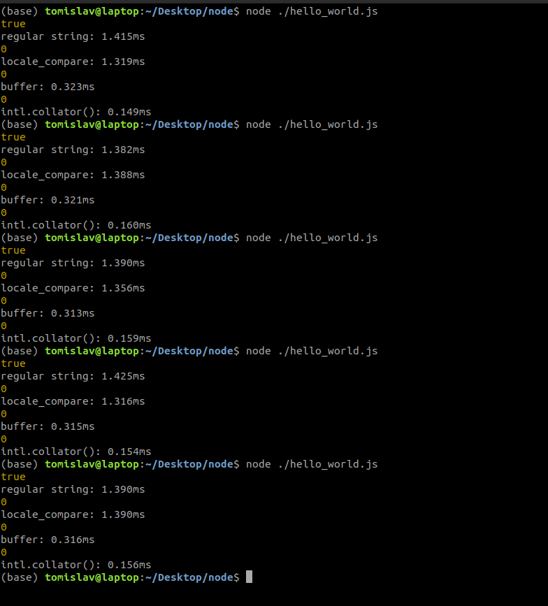

# Performance Trials of JavaScript String Comparison Methods
This is a set of trials conducted on various javascipt methods to test the performance of each when it comes to comparing two strings.

### First Method

``const var_1 = "Try This"``

``const var_2 = "Try This"``

``console.log(var_1 === var_2)``

*Results were as follows*: 
1.415 ms
1.382 ms
1.390 ms
1.425 ms
1.390 ms

### Second Method

``const s1 = 'Hello World';``

``const s2 = 'Hello World';``

``console.log(s1.localeCompare(s2))``

*Results were as follows*:
1.319 ms
1.388 ms
1.356 ms
1.316 ms
1.390 ms

### Third Method

``let buf1 = Buffer.from('Hello, World', 'utf8');``

``let buf2 = Buffer.from('Hello, World', 'utf8');``

``console.log(Buffer.compare(buf1, buf2));``

*Results were as follows*:
0.323 ms
0.321 ms
0.313 ms
0.315 ms
0.316 ms

### Fourth Method
``const collator_var_1 = "Hello World"``

``const collator_var_2 = "Hello World"``

``console.log(new Intl.Collator().compare(collator_var_1, collator_var_2));``

*Results were as follows*:
0.149 ms
0.160 ms
0.159 ms
0.154 ms
0.156 ms

